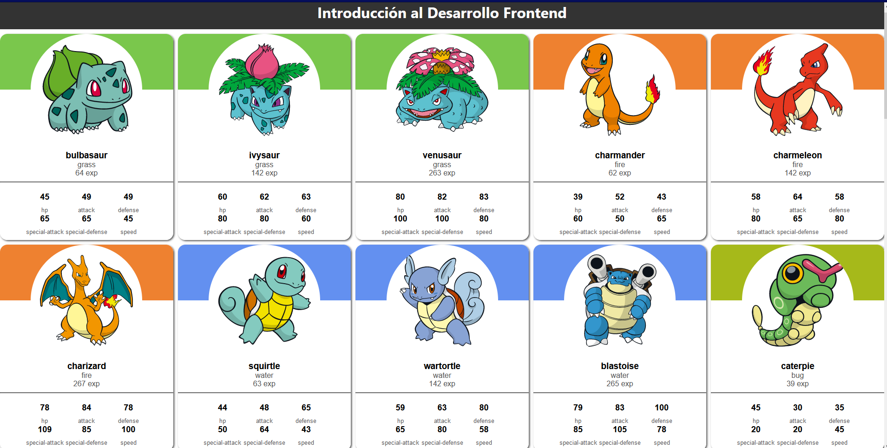
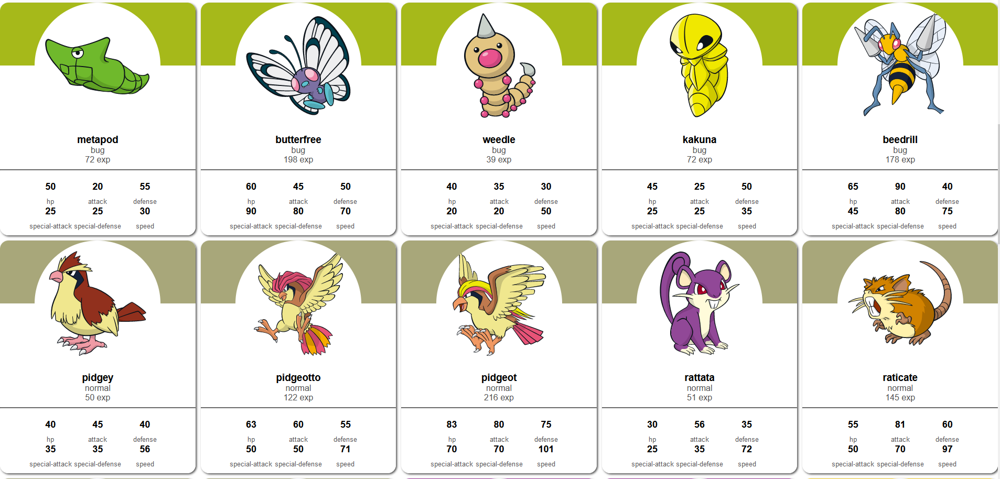
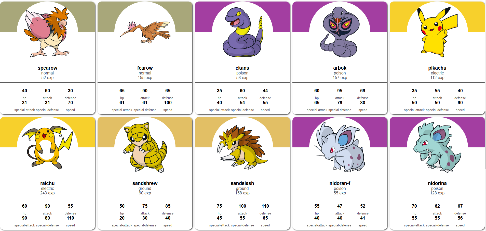

# React-101

Este repositorio contiene un ejemplo de aplicación React que muestra una lista de Pokémon utilizando la API de Pokémon.

## Componente Principal (Main)

El componente principal de la aplicación se encuentra en `src/components/main/index.tsx`. Este componente es responsable de obtener los datos de los Pokémon de la API y renderizarlos en la interfaz de usuario.

### Funciones y Estados

El componente principal utiliza varios estados y funciones:

- `pokemons`: Un estado que almacena una lista de Pokémon obtenidos de la API.
- `offset`: Un estado que se utiliza para la paginación de los resultados de la API.
- `limit`: Una constante que define el número de Pokémon que se obtienen en cada solicitud a la API.
- `fetchPokemons`: Una función que obtiene una lista de Pokémon de la API y actualiza el estado `pokemons`.
- `useEffect`: Un hook de efecto que se ejecuta cuando el componente se monta y cada vez que el estado `offset` cambia. Llama a la función `fetchPokemons`.
- `renderPokemons`: Una función que mapea la lista de Pokémon a componentes `PokeCard`.
- `onclickButton`: Una función que incrementa el estado `offset` en `limit` cada vez que se hace clic en el botón "Siguientes".

### Renderizado

El componente principal renderiza una lista de Pokémon utilizando el componente `PokeCard`. Cada `PokeCard` recibe un objeto Pokémon como prop `data`. La lista de Pokémon se renderiza en un grid con 5 columnas.

Debajo de la lista de Pokémon, hay un botón "Siguientes" que carga los siguientes Pokémon cuando se hace clic en él.

## Componente PokeCard

El componente `PokeCard` se encuentra en `src/components/card/index.tsx`. Este componente es responsable de renderizar la información de un solo Pokémon. Recibe un objeto Pokémon como prop `data` y muestra la imagen y el nombre del Pokémon.

## Servicios

La aplicación utiliza dos servicios para interactuar con la API de Pokémon:

- `getPokemons`: Obtiene una lista de Pokémon de la API.
- `getPokemonsDetails`: Obtiene los detalles de un Pokémon específico de la API.

Estos servicios se encuentran en `src/services/pokeapi.ts`.

## Interfaces

La aplicación utiliza dos interfaces para tipar los datos de los Pokémon:

- `Pokemon`: Define la estructura de los datos de un Pokémon.
- `Detail`: Define la estructura de los detalles de un Pokémon.

Estas interfaces se encuentran en `src/interfaces/pokemon.ts`.

## Cómo ejecutar el proyecto

Para ejecutar este proyecto en tu entorno local, sigue estos pasos:

1. **Clona el repositorio**

   Primero, debes clonar el repositorio en tu máquina local. Puedes hacerlo con el siguiente comando:

   ```bash
   git clone https://github.com/luksolivera/react-101.git
   ```

2. **Instala las dependencias**

   Navega hasta el directorio del proyecto y ejecuta el siguiente comando para instalar todas las dependencias necesarias:

   ```bash
   cd react-101
   npm install
   ```

   O si prefieres usar `yarn`:

   ```bash
   yarn install
   ```

3. **Ejecuta el proyecto**

   Ahora puedes ejecutar el proyecto con el siguiente comando:

   ```bash
   npm start
   ```

   O si prefieres usar `yarn`:

   ```bash
   yarn start
   ```

   Esto iniciará el servidor de desarrollo y abrirá la aplicación en tu navegador predeterminado.
4. **Ejemplo**





## Contribuir

Si deseas contribuir a este proyecto, por favor, primero discute el cambio que deseas hacer a través de un issue antes de hacer el cambio.

Asegúrate de actualizar las pruebas según corresponda.

## Licencia

Este proyecto está licenciado bajo los términos de la licencia MIT. Para más detalles, por favor, consulta el archivo `LICENSE` en el repositorio.
